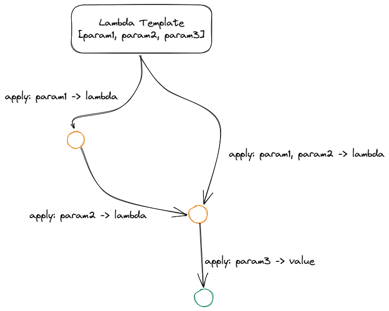

# Jnsp-004: Functional Programming

Janiva supports lambdas (lambdas and functions can be used interchangeably, depending on the context).

## Built-in

## Lambda definition
Lambdas are defined at the top of the script file, like this 
```
@lambda :: (x1, x2) >> $x1 + $x2 #
```
Some key components in this definition are
- Lambda name: name of the lambda is defined with `@` sign
- a `::` separates lambda name and the actual template definition of the lambda
- `x1` and `x2` in the definition above indicates the parameter list
- `>>` separates parameter list and the actual implementation;

### Namespacing

When a janiva file is imported, all lambda definitions in that file are registered. In order to avoid conflict, 
namespacing is necessary. One need to use `namespace` keyword at the top of the file, like this

```
namespace some_namespace
```

or separate them using `.` to provide grouped namespace style

```
namespace com.xmbsmdsj.some_namespace
```

this allows lambdas to be registered under certain namespace. If no namespace is registered, runtime will pick up a default 
one, naming `default`.

Namespaces are currently only used to segregate lambda definitions. Invoking a lambda from another namespace/file is handled
by `import` and `export` mechanism.

## Partial application

Partial application is data flow. Lambdas are partially applied by feeding data into it using `<<` operator. A lambda 
with `N` parameters can be fed `(N-1)` values in order to keep being lambda. For example 

```
@func :: (a, b) >> a > b #
{
    // Here _func is still lambda
    _func << @func << 1,
    
    // However _func2 is automatically evaluated to a value 'false'
    _func2 << @func << 1 << 2,
    
    "result": @_func << 2,
}
```

This is auto-evaluation property of janiva's lambda, saying if a lambda with `N` parameters is fed exactly `N` values, 
it will be automatically evaluated. Because if it doesn't, there's no syntax to evaluate a lambda with no argument.

**Note that built-in lambdas are not partially applicable**

## Lambda Composition
Lambdas can be composed. Partially applied lambdas can be composed to a single one, for example, `f1 :: (number, number) >> {?}` and 
`f2 :: ({?}) >> [?]` can be composed together to produce a new one : `f3 :: (number, number) >> [?]`.

Lambda composition is performed using `@compose` built-in, for example

```
// Note that we need to add brackets to lambdas to be composed if it is followed by << operators.
@compose << (@f1) << (@f2)

// Here @f1 is partially applied 
@compose << (@f1 << 1) << @f2
```

## Lambda hierarchy

Lambdas are defined by lambda templates, which includes
- name
- parameter name list
- body
  - ast which is interpreted by janiva runtime
  - frame descriptor, which defined shape of the frame

When lambdas are cached or partially applied, derived lambdas are created, which still share template with their 
ancestors.



## Recursion

Lambdas can be recursively invoked, here's one recursive example of calculating fibonacci
```
// Naive approach of calculating fibonacci
@fibb :: (x) >>
    @if << ($x < 2)
    << 1
    << @fibb << ($x - 1) + @fibb << ($x - 2) #

@stdout << {
    "result": @fibb << 4
}
```

## Composition

Lambdas can be composed to produce a new one, the composed lambda acts like a 
'pipeline' of the composing lambdas. For example, when you composing l1 and l2 below
```
@l1 :: (a) -> $a + 1 #
@l2 :: (a) -> $a - 1 #
```

you'll produce a new lambda that applies l1 to its argument, and use the result
as argument of l2, which is equivalent to

```
@composed :: (a) -> (($a + 1) - 1)
```

Composing is performed using `@compose` built in

```
{
  // Compose l1 and l2, and bind the result to l3
  // @l1 and @l2 produce partially-applied lambdas with zero argument
  l3 << @compose << (@l1) << (@l2),
}
```


